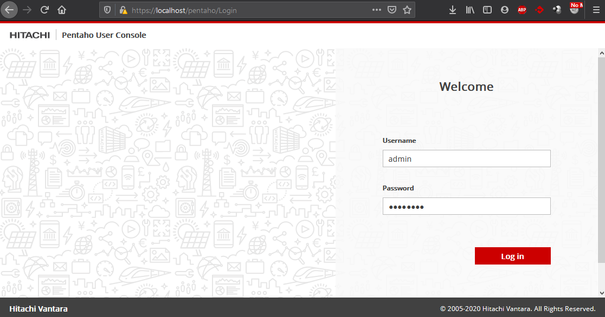
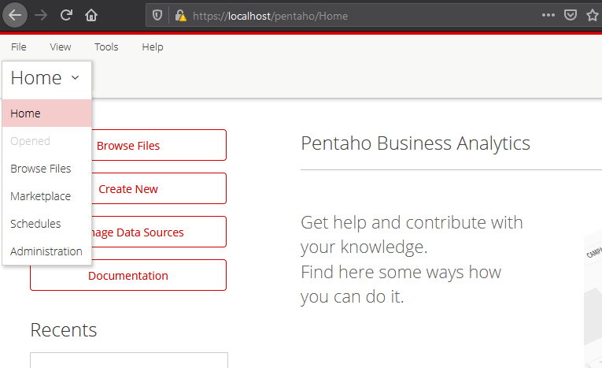
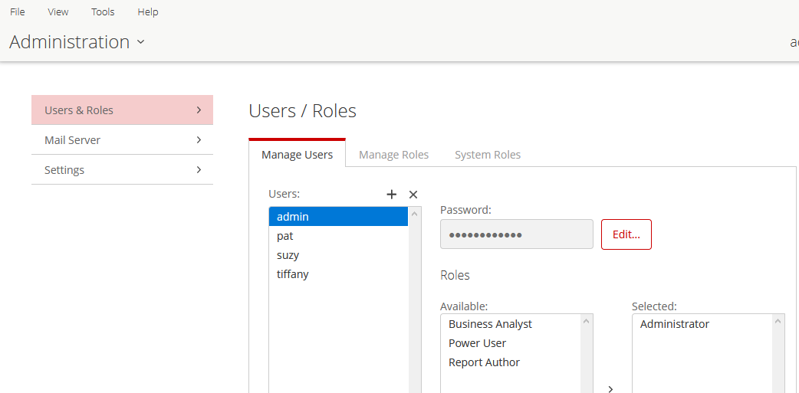
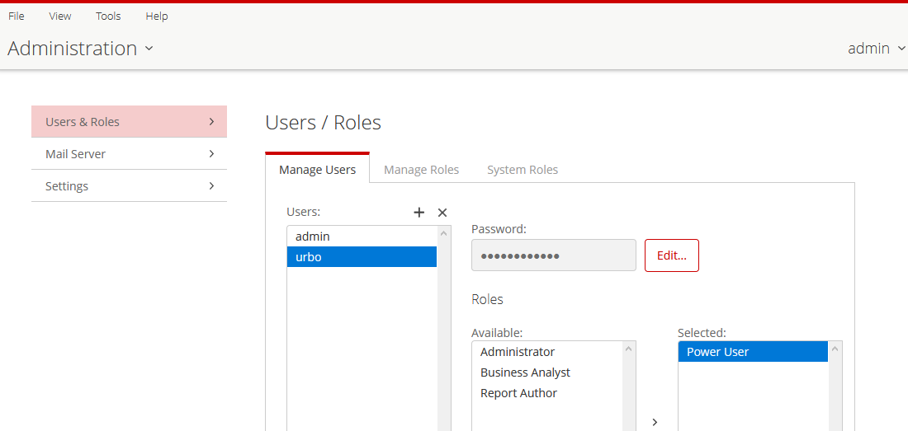
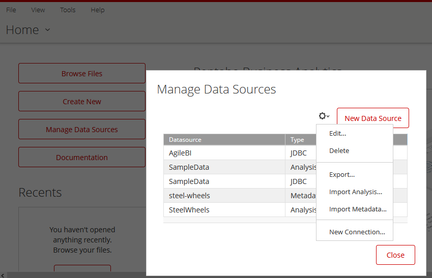
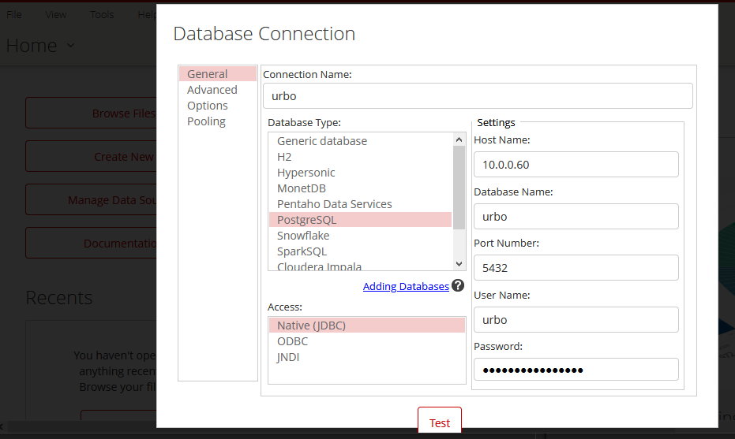
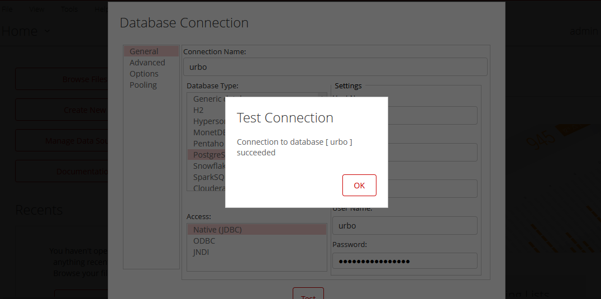

# Procedimiento instalación Urbo, Pentaho

## Introducción

Este documento describe el procedimiento a seguir para desplegar los servicios de Urbo y/o Pentaho en alta disponibilidad, en servidores dedicados (físicos o virtuales), así como las pruebas de validación y monitorización del servicio.

### Aclaración proxy inverso

Estas instrucciones incluyen también la instalación de un proxy inverso (Se eligió `traefik` por facilidad para gestionar certificados). Este proxy inverso solo se utiliza para poder hacer pruebas de conexión con Pentaho, en los siguientes casos:

- Si se instala antes de que esté disponible el balanceador del proyecto.
- Si hay algún problema con la configuración del balanceador, y se quiere probar accediendo directamente a los nodos.
- Si hay problemas solo en uno de los dos servidores de la pareja de HA, y se quiere acceder específicamente al servidor con problemas, evitando que el balanceador nos pueda enviar al otro nodo.

Esos son los únicos casos en los que está recomendado el uso del proxy inverso. En particular, el proxy inverso **NO** se debe usar desde el balanceador del proyecto, sino que éste debe usar los puertos directos de los servicios:

- Pentaho: puerto 7001
- Urbo: puerto 8080

## Prerequisitos

### Docker

El servicio depende de docker y docker-compose. A la hora de definir los nombres de paquetes software y las configuraciones de software, se asume que la instalación se hará en servidor RedHat o Centos versión 7. En caso de desplegarse en otro entorno, los comandos y nombres de paquetes pueden variar.

El servicio se ha probado con las versiones de docker y docker-compose presentes en los repositorios de RedHat EL 7.x:

* Docker version 1.13.1, build 4ef4b30/1.13.1
* docker-compose version 1.18.0, build 8dd22a9

No se anticipa ninguna incompatibilidad con versiones posteriores, siempre que provengan del fabricante (repositorios oficiales de RedHat o CentOS). La instalación es estándar:

```bash
$ sudo yum install docker docker-compose
$ sudo systemctl enable --now docker
```

### Docker bridge

En el entorno de Telefónica, las máquinas suelen tener varias interfaces de red. Ocasionalmente, eso puede provocar que el servicio de docker no arranque correctamente. Antes de proceder con la instalación, debe comprobarse que el servicio de docker está correctamente arrancado:

```bash
$ sudo systemctl status docker
### Docker network docker.service - Docker Application Container Engine
   Loaded: loaded (/usr/lib/systemd/system/docker.service; enabled; vendor preset: disabled)
   Active: active (running) since Tue 2020-01-14 18:07:32 CET; 1 months 3 days ago
     Docs: http://docs.docker.com
 Main PID: 25234 (dockerd-current)
    Tasks: 70
   Memory: 78.8M
   CGroup: /system.slice/docker.service
           25234 /usr/bin/dockerd-current --add-runtime docker-runc=/usr/libexec/docker/docker-runc-current --default-runtime=docker-runc --authorization-plugin=rhel-push-plu...
           25242 /usr/bin/docker-containerd-current -l unix:///var/run/docker/libcontainerd/docker-containerd.sock --metrics-interval=0 --start-timeout 2m --state-dir /var/ru...
```

En caso contrario se verificará que la red vitual `docker0` existe y tiene una dirección IP:

```bash
$ sudo ip address show dev docker0 scope global
4: docker0: <NO-CARRIER,BROADCAST,MULTICAST,UP> mtu 1500 qdisc noqueue state DOWN group default qlen 1000
    link/ether 00:00:00:00:00:00 brd ff:ff:ff:ff:ff:ff
    inet 172.17.0.1/16 scope global docker0
       valid_lft forever preferred_lft forever
```

Si la red no existiera, sería necesario crearla manualmente para que el demonio docker la reconozca y arranque:

```bash
# Sólo si la interfaz no existe ya!
$ sudo ip link add dev docker0 type bridge
$ sudo systemctl restart docker
```

Si no existía, o aún existiendo no tuviera una dirección IPv4, sería necesario añadirla manualmente, y posteriormente reiniciar el servicio:

```bash
# Solo si la interfaz no tiene ya dirección IP!
$ sudo ip addr add dev docker0 172.17.0.1/16
$ sudo systemctl restart docker
```

### Docker network

El despliegue de Pentaho en máquinas virtuales utiliza docker-compose v3. A partir de la versión v2, los contenedores creados por docker-compose no utilizan por defecto la red `docker0`, sino que crean una nueva red ad-hoc al lanzar el compose.

Este comportamiento puede fallar por el mismo motivo que el arranque de docker (múltiples interfaces de red en la máquina). Para evitar este problema, sugerimos crear manualmente una red docker tipo `bridge` con nombre `composer`, que luego usarán los contenedores. En este documento se propone el rango de red 172.18.0.0/24, aunque es indiferente:

```bash
$ docker network create --driver=bridge \
  --opt com.docker.network.bridge.enable_icc=true \
  --opt com.docker.network.bridge.enable_ip_masquerade=true \
  --opt com.docker.network.bridge.host_binding_ipv4=0.0.0.0 \
  --subnet=172.18.0.0/24 composer

$ sudo docker network inspect composer
[
  {
    "Name": "composer",
    "Id": "f5a626136fb616970a3db7a6f1cde2752a4feb79a1362b5d1d5f0ebd7f49d3e4",
    "Created": "2020-06-15T17:57:00.566026661+02:00",
    "Scope": "local",
    "Driver": "bridge",
    "EnableIPv6": false,
    "IPAM": {
      "Driver": "default",
      "Options": {},
      "Config": [
        {
          "Subnet": "172.18.0.0/24"
        }
      ]
    },
    "Internal": false,
    "Attachable": false,
    "Options": {
      "com.docker.network.bridge.enable_icc": "true",
      "com.docker.network.bridge.enable_ip_masquerade": "true",
      "com.docker.network.bridge.host_binding_ipv4": "0.0.0.0"
    },
    "Labels": {}
  }
] 
```

Para que la red docker permita el tráfico, es necesario configurar varios parámetros del kernel de linux. Se deben establecer los siguientes valores de sysctl:

```bash
sysctl net.ipv4.ip_forward = 1
sysctl net.ipv4.conf.all.forwarding = 1
```

Para que estos parámetros sigan aplicando después del arranque, deben guardarse en un fichero en **/etc/sysctl.d**.

### Herramientas 

Se recomienda también tener instaladas en el servidor otras herramientas útiles para editar ficheros, descomprimir carpetas, etc:

```bash
sudo yum install -y git unzip wget vim nano
```

### Volúmenes

La aplicación utiliza varios directorios:

* `/opt/platform`: Este directorio contiene los volúmenes de iconos y temas de Urbo.
* `/opt/pentaho`: Este directorio contendrá el volumen `pentaho-server` con la distribución de pentaho.
* `/opt/traefik`: Este directorio contendrá la configuración del proxy inverso local.
* `/opt/composer/platform`: Este directorio contendrá el manifiesto de docker-compose que lanzará el servicio.

Por convención, todos estos directorios se hacen pertenecer al UID 1000:

```bash
$ sudo mkdir -p /opt/platform
$ sudo mkdir -p /opt/pentaho
$ sudo mkdir -p /opt/traefik
$ sudo mkdir -p /opt/composer/platform

$ sudo chown -R 1000:1000 /opt/platform
$ sudo chown -R 1000:1000 /opt/pentaho
$ sudo chown -R 1000:1000 /opt/traefik
$ sudo chown -R 1000:1000 /opt/composer/platform
```

Además, docker utiliza el directorio */var/lib/docker* para almacenar capas e imágenes. Si se monta un volumen XFS en esa ruta, **debe estar formateado con ftype=1**:

```bash
$ mkfs.xfs -n ftype=1 /dev/whatever
```

## Instalación

### Descarga de Pentaho

La imagen de Pentaho se descarga desde su [repositorio público en sourceforge](https://sourceforge.net/projects/pentaho/files/). En el momento de redacción de esta guía, la versión sugerida es la [8.3.0.0-371](https://sourceforge.net/projects/pentaho/files/Pentaho%208.3/server/pentaho-server-ce-8.3.0.0-371.zip/download#). Esta imagen debe descargarse y descomprimirse en la ruta `/opt/pentaho`:

```bash
$ cd /opt/pentaho
$ sudo wget "https://sourceforge.net/projects/pentaho/files/Pentaho%208.3/server/pentaho-server-ce-8.3.0.0-371.zip/download#" -O pentaho-server.zip
$ sudo unzip pentaho-server.zip
$ sudo chown -R 1000:1000 pentaho-server
```

Tras la extracción, deberá existir una carpeta `/opt/pentaho/pentaho-server` con al menos los siguientes ficheros:

```bash
sudo ls -l /opt/pentaho/pentaho-server
total 68
drwxr-xr-x  9 1000 1000  287 Jun 12  2019 data
-rw-rw-r--  1 1000 1000 1332 Jun 11  2019 import-export.bat
-rwxr-xr-x  1 1000 1000 1774 Jun 11  2019 import-export.sh
drwxrwxrwx  2 1000 1000   45 Jun 12  2019 licenses
drwxr-xr-x  4 1000 1000   42 Jun 12  2019 pentaho-solutions
-rw-rw-r--  1 1000 1000 1693 Jun 11  2019 promptuser.js
-rwxr-xr-x  1 1000 1000 1835 Jun 11  2019 promptuser.sh
-rw-rw-r--  1 1000 1000 5092 Jun 11  2019 set-pentaho-env.bat
-rwxr-xr-x  1 1000 1000 4634 Jun 11  2019 set-pentaho-env.sh
-rw-rw-r--  1 1000 1000 2086 Jun 11  2019 start-pentaho-debug.bat
-rwxr-xr-x  1 1000 1000 2333 Jun 11  2019 start-pentaho-debug.sh
-rw-rw-r--  1 1000 1000 2030 Jun 11  2019 start-pentaho.bat
-rwxr-xr-x  1 1000 1000 2293 Jun 11  2019 start-pentaho.sh
-rw-rw-r--  1 1000 1000 1633 Jun 11  2019 stop-pentaho.bat
-rwxr-xr-x  1 1000 1000 1546 Jun 11  2019 stop-pentaho.sh
drwxr-xr-x  3 1000 1000   27 Jun 12  2019 third-party-tools
drwxrwxrwx 10 1000 1000  234 Jun 11  2019 tomcat
```

### Obtención de imagen docker Urbo

La imagen de Urbo se encuentra en un repositorio docker privado. Para poder utilizarla, se debe iniciar sesión con el comando `docker login`:

```bash
docker login

# La versión de imagen de Urbo a fecha de redacción de este documento es 2.10.0
docker pull telefonicaiot/urbo2:2.10.0
```

Una vez completadas las descargas de esta imagen y la de Pentaho, se debe recordar cerrar sesión con `docker logout`.

### Obtención de imagen docker Pentaho

La ejecución de Pentaho tiene una multitud de prerequisitos: ciertas versiones de librerías de apoyo (JRE, Tomcat native, drivers JDBC...), variables de entorno (PENTAHO_HOME, JAVA_HOME...), configuraciones (variados ficheros .xml, .conf, properties...) e incluso scripts de pre-instalación (creación de esquemas en bases de datos, recompilación de ficheros .jar...).

Para simplificar el proceso de despliegue, todas estas dependencias y prerequisitos se han empaquetado en una imagen docker, de código abierto, con copyright de Telefónica de España: https://hub.docker.com/r/telefonicaiot/pentaho-dsp.

La versión recomendada de la imagen durante la redacción de este documento es la **1.1.6**. La imagen debe descargarse al repositorio local con:

```bash
$ docker pull telefonicaiot/pentaho-dsp:1.1.6
$ docker image ls telefonicaiot/pentaho-dsp 
REPOSITORY                            TAG                 IMAGE ID            CREATED             SIZE
docker.io/telefonicaiot/pentaho-dsp   1.1.6               e6d959d3b73b        9 days ago          635 MB  
```

### Clonado de repositorios de iconos y temas

Además de la imagen, para poner Urbo en producción se necesita clonar los repositorios de temas e iconos de Urbo:

- El repositorio de temas está en https://github.com/telefonicasc/urbo-icons,
- El repositorio de temas es propio de cada proyecto.

Por convención se suelen clonar ambos debajo de `$HOME/projects`:

```bash
cd
mkdir projects
cd projects
git clone https://github.com/telefonicasc/urbo-icons
git clone https://github.com/telefonicasc/XXXXXX-project
```

Una vez clonados, copiareamos los directorios relevantes a la ruta `/opt/platform/`:

- Iconos de urbo: `/opt/platform/urbo-icons`

```bash
sudo mkdir -p /opt/platform/urbo-icons
sudo cp -r $HOME/projects/urbo-icons/verticals /opt/platform/urbo-icons
sudo chown -r 1000:1000 /opt/platform/urbo-icons
```

- Temas de urbo: `/opt/platform/tenantThemes`

```bash
sudo mkdir -p /opt/platform/tenantThemes
sudo cp -r $HOME/projects/XXXXXX-project/PRO/branding/* /opt/platform/tenantThemes
sudo chown -r 1000:1000 /opt/platform/tenantThemes
```

### Preparación de base de datos Pentaho

El último prerequisito es crear las bases de datos postgresql donde Pentaho almacenará el estado y configuración de la aplicación. Pentaho utiliza tres bases de datos:

- DB: **iot_jackrabbit**, usuario **iot_jcr_user**.
- DB: **iot_quartz**, usuario **iot_pentaho_user**.
- DB: **iot_hibernate**, usuario: **iot_hibuser**.

Las bases de datos pueden crearse con el siguiente código SQL (**Importante:** cambiar los passwords por valores seguros):

```sql
CREATE USER iot_jcr_user PASSWORD 'JACKRABBIT_PASSWORD';
CREATE DATABASE iot_jackrabbit WITH OWNER = iot_jcr_user ENCODING = 'UTF8' TABLESPACE = pg_default;
GRANT ALL PRIVILEGES ON DATABASE iot_jackrabbit to iot_jcr_user;

CREATE USER iot_pentaho_user PASSWORD 'QUARTZ_PASSWORD';
CREATE DATABASE iot_quartz  WITH OWNER = iot_pentaho_user  ENCODING = 'UTF8' TABLESPACE = pg_default;
GRANT ALL PRIVILEGES ON DATABASE iot_quartz to iot_pentaho_user;

CREATE USER iot_hibuser PASSWORD 'HIBERNATE_PASSWORD';
CREATE DATABASE iot_hibernate WITH OWNER = iot_hibuser ENCODING = 'UTF8' TABLESPACE = pg_default;
GRANT ALL PRIVILEGES ON DATABASE iothibernate to iot_hibuser;
```

El servidor de bases de datos debe ser accesible desde el servidor donde se instala Pentaho. Esto se puede comprobar ejecutando los siguientes comandos (**Nota**: es necesario tener a mano las contraseñas de los tres usuarios anteriores):

```bash
# Para tener acceso al cliente de línea de comandos psql
$ sudo yum install postgresql
# Cambiar por el nombre o dirección del servidor postgres
$ export PSQL_SERVER=10.0.0.60

$ psql -c "SELECT 1;"  -U "iot_jcr_user" -h "${PSQL_SERVER}" "iot_jackrabbit"
Password for user iot_jcr_user:
 ?column?
----------
        1
(1 row)

$ psql -c "SELECT 1;" -U "iot_pentaho_user" -h "${PSQL_SERVER}"  "iot_quartz"
Password for user iot_pentaho_user:
   lock_name
----------------
 TRIGGER_ACCESS
(1 row)

$ psql -c "SELECT 1;" -U "iot_hibuser" -h "${PSQL_SERVER}" "iot_hibernate"
Password for user iot_hibuser:
 ?column?
----------
        1
(1 row)
```

### Configuración de nodo principal

Se asume que la instalación de Pentaho se hará mediante un cluster de dos nodos en alta disponibilidad. **Cada nodo de Pentaho necesita de un ID único dentro del cluster**, que se provisiona ejecutando estos comandos en el servidor principal:

```bash
# Credenciales de los usuarios de bases de datos.
$ export JACKRABBIT_PASSWORD=...
$ export QUARTZ_PASSWORD=...
$ export HIBERNATE_PASSWORD=...

# Datos de acceso a postgres
$ export POSTGRES_HOST=...
$ export POSTGRES_PORT=5432

# "node1" es el nombre que daremos al nodo principal del cluster.
$ sudo docker run --rm -it -v /opt/pentaho/pentaho-server:/opt/pentaho-server \
  -e JACKRABBIT_PASSWORD="$JACKRABBIT_PASSWORD" \
  -e QUARTZ_PASSWORD="$QUARTZ_PASSWORD" \
  -e HIBERNATE_PASSWORD="$HIBERNATE_PASSWORD" \
  telefonicaiot/pentaho-dsp:1.1.6 /opt/config.sh \
  "$POSTGRES_HOST" "$POSTGRES_PORT" iot_ deprecated "node1" > /opt/pentaho/schema.sql
```

Este comando configura los ficheros en la ruta /opt/pentaho/pentaho-server para usar postgres como backend, y crea un fichero **/opt/pentaho/schema.sql** con las órdenes necesarias para crear el schema requerido en la base de datos.

Si el proceso de configuración se completa correctamente, creará un fichero **/opt/pentaho/pentaho-server/env.postgresql** como el siguiente, con las credenciales de acceso a la base de datos:

```bash
$ cat /opt/pentaho/pentaho-server/env.postgresql
DB_SERVER="10.0.0.60"
DB_PORT="5432"
DB_PREFIX="iot_"
JACKRABBIT_PASSWORD="<password>"
QUARTZ_PASSWORD="<password>"
HIBERNATE_PASSWORD="<password>"
DB_PASSWORD="deprecated"
DB_CLUSTER="node1"
```

La variable `DB_CLUSTER` debe tener un valor distinto en cada servidor de Pentaho. Por ejemplo, si en el primer servidor de PEntaho hemos usado *node1*, en el segundo servidor podemos usar *node2*. Si ambos servidores tienen configurados el mismo ID de cluster, se corre el riesgo de que corrompan la base de datos al escribir los dos a la vez.

A pesar de que las claves de acceso a la base de datos se almacenen en este fichero en texto plano, esto no se considera un fallo crítico de seguridad porque estos mismos passwords están almacenados en otros ficheros de configuración *.xml* y *.conf* del volumen /opt/pentaho/pentaho-server, y deben estar sin cifrar por requerimientos de Pentaho. La existencia del fichero *env.postgresl* no hace este despliegue más inseguro, sólo hace la inseguridad que ya existía más evidente.

- Se debe proteger adecuadamente el acceso al servidor, y al volumen /opt/pentaho/pentaho-server.
- Se recomienda que los backups se almacenen cifrados.

Actualmente, no es necesario importar manualmente en la base de datos el schema generado por esta herramienta, ya que el propio contenedor lo hará si detecta que la base de datos es accesible pero no está inicializada. En el apartado posterior dedicado a logs se indica cómo detectar que el contenedor carga el schema correctamente.

### Configuración de nodo de respaldo

El servidor Pentaho de respaldo se configura exactamente igual que el principal, pero **utilizando un nombre de nodo distinto**, por ejemplo `node2` en lugar de `node1`:

```bash
# Credenciales de los usuarios de bases de datos.
$ export JACKRABBIT_PASSWORD=...
$ export QUARTZ_PASSWORD=...
$ export HIBERNATE_PASSWORD=...

# Datos de acceso a postgres
$ export POSTGRES_HOST=...
$ export POSTGRES_PORT=5432

# "node2" es el nombre que daremos al nodo principal del cluster.
$ sudo docker run --rm -it -v /opt/pentaho/pentaho-server:/opt/pentaho-server \
  -e JACKRABBIT_PASSWORD="$JACKRABBIT_PASSWORD" \
  -e QUARTZ_PASSWORD="$QUARTZ_PASSWORD" \
  -e HIBERNATE_PASSWORD="$HIBERNATE_PASSWORD" \
  telefonicaiot/pentaho-dsp:1.1.6 /opt/config.sh \
  "$POSTGRES_HOST" "$POSTGRES_PORT" iot_ deprecated "node2"
```

De nuevo, la correcta ejecución de este script generará un fichero */opt/pentaho/pentaho-server/env.postgresql* como el siguiente contenido (comprobar que el ID de nodo, variable `DB_CLUSTER`, es diferente al otro servidor):

```bash
$ cat /opt/pentaho/pentaho-server/env.postgresql
DB_SERVER="10.0.0.60"
DB_PORT="5432"
DB_PREFIX="iot_"
JACKRABBIT_PASSWORD="<password>"
QUARTZ_PASSWORD="<password>"
HIBERNATE_PASSWORD="<password>"
DB_PASSWORD="deprecated"
DB_CLUSTER="node2"
```

### Configuración del servicio

El servicio se ejecuta como un stack de **docker-compose** con dos contenedores: el propio Pentaho, y un proxy inverso traefik que proporciona la interfaz HTTPS. La configuración del servicio docker-compose se hace mediante los dos ficheros siguientes:

- Copiar el fichero [platform.yaml](files/platform.yaml) en la ruta **/opt/traefik/platform.yaml**
- Copiar el fichero [.env](files/env) en la ruta **/opt/composer/platform/.env**:
- Copiar el fichero [docker-compose.yaml](files/docker-compose.yaml) en la ruta **/opt/composer/platform/docker-compose.yaml**:
- Copiar el fichero [compose@.service](files/compose@.service) en la ruta **/etc/systemd/system/compose@.service**
- Editar el fichero `/opt/composer/platform.env` para establecer los parámetros adecuados:

```bash
# Versiones de software
URBO2_VERSION=2.10.0
PENTAHO_VERSION=1.1.6
TRAEFIK_VERSION=2.2
# Rutas
URBO_ICONS_PATH=/opt/platform/urbo-icons
TENANT_THEMES_PATH=/opt/platform/tenantThemes
PENTAHO_PATH=/opt/pentaho
TRAEFIK_PATH=/opt/traefik
# Settings de Urbo
URBO2_LOG_LEVEL=INFO
URBO2_LOG_OB=ES
URBO2_LOG_COMP=Urbo2
URBO2_KEYSTONE_ENDPOINT=<URL_KEYSTONE>
URBO2_SESSION_SECRET=<GENERAR UN SECRETO ALEATORIO>
URBO2_SESSION_EXP_TIME=3600
URBO2_REJECT_UNAUTHORIZED=false
URBO2_MONGO_URI=mongodb://<SERVIDOR_1>,<SERVIDOR_2>,<SERVIDOR_3>:27017/urbo2?replicaSet=<REPLICASET>
URBO_MONGO_RETRIES=10
URBO_MONGO_RECONNECT_INTERVAL=5000
URBO2_MONGO_USERNAME=
URBO2_MONGO_PASSWORD=
```

### Ejecución del servicio

Una vez creados estos ficheros, el servicio puede lanzarse con el comando:

```bash
$ cd /opt/composer/platform
$ docker-compose up -d
```

O como servicio con systemd, usando los comandos:

```bash
sudo systemctl daemon-reload
sudo systemctl start compose@platform
```

El estado del servicio puede comprobarse con:

```bash
$ cd /opt/composer/platform
$ docker-compose ps
 Name                Command               State                                   Ports
------------------------------------------------------------------------------------------------------------------------
pentaho   /tini -- /bin/sh -c /opt/ ...    Up      0.0.0.0:7001->7001/tcp,:::7001->7001/tcp, 8080/tcp
traefik   /entrypoint.sh --entryPoin ...   Up      0.0.0.0:443->443/tcp,:::443->443/tcp,
                                                   0.0.0.0:80->80/tcp,:::80->80/tcp
urbo2     docker-entrypoint.sh npm start   Up      0.0.0.0:8081->8081/tcp,:::8081->8081/tcp, 9229/tcp

$ docker-compose logs pentaho -f | grep "Pentaho BI Platform server is ready"
pentaho    | Pentaho BI Platform server is ready. (pentaho-platform-core 8.3.0.0-371)
```

Una vez que se alcance el estado "*Pentaho BI platform server is ready*" (puede tardar varios minutos), el servicio Pentaho estará **accesible en los puertos 80 (http) y 443 (https)** del servidor, a través de la ruta `http://<ip del servidor>/pentaho`.

Si se quiere que el servicio se arraque automáticamente cuando arranca el servidor, se puede activar el servicio en systemd con los comandos:

```bash
sudo systemctl daemon-reload
sudo systemctl enable compose@platform
```

## Log y posibles errores

El contenedor de pentaho ejecuta una serie de checks iniciales antes de intentar lanzar la aplicación. Si alguno de los checks falla, el contenedor logará un mensaje de error y un texto de ayuda con un resumen de las instrucciones de uso.

Este apartado se ocupa únicamente de los mensajes de error de este script de inicialización; los posibles mensajes de error de Pentaho no son configurables ni es posible acotarlos o enumerarlos todos. En cualquier caso, el script de inicialización es bastante exhaustivo y si se completa sin error, el único motivo de fallo posible es la corrupción del volumen /opt/pentaho. Este caso podría solucionarse simplemente con una restauración de backup de disco, sin necesidad de restaurar el backup de la base de datos.

### Acceso a volúmenes

Si los prerequisitos de despliegue de pentaho no se han cumplido, el contenedor fallará con alguno de los mensajes siguientes:

- "REQUIREMENT ERROR: Folder not found" o "REQUIREMENT ERROR: Not a volume":

  Comprobar en el docker-compose que se está montando el directorio */opt/pentaho/pentaho-server* del host en la ruta */opt/pentaho-server* del contenedor.

- "REQUIREMENT ERROR: Folder /opt/pentaho-server is not writeable":

  Comprobar que se ha cambiado el UID y GID de la ruta /opt/pentaho/pentaho-server (y todo lo que hay debajo) a **1000:1000**

- "REQUIREMENT ERROR: Folder /opt/pentaho-server does not contain Pentaho distribution":

  Comprobar que se ha descomprimido correctamente el zip de pentaho en /opt/pentaho, creando el directorio /opt/pentaho/pentaho-server.

### Fallo de configuración

- "REQUIREMENT ERROR: Configuration utility has not been run":

  Este error se produce porque el contenedor no encuentra el fichero *env.postgresql* creado por el script de configuración. Comprobar que se ha ejecutado la configuración de pentaho de acuerdo al apartado [configuración de nodo principal] o [configuración de nodo de respaldo], respectivamente, en cada nodo.

### Conectividad a la base de datos

Si el servicio no puede conectar a la base de datos, generará un mensaje como el siguiente al arrancar:

```bash
iot-pentaho    | psql: could not connect to server: No route to host
```

Se debe:

- Comprobar que la red docker **composer** existe.
- Comprobar que los contenedores ejecutándose en esa red tienen acceso al exterior. Por ejemplo, lanzando un contenedor con algún comando que acceda a la red, como "apt update" en un contenedor ubuntu:

```bash
docker run --rm -it ubuntu:latest --network composer apt update
```

- Comprobar que las variables *net.ipv4.ip_forward* y *net.ipv4.conf.all.forwarding* están a 1.
- Revisar las iptables o reglas de firewall.

### Creación del schema

La primera vez que se ejecuta el contenedor, detectará que el schema de la base de datos no ha sido instalado, e intentará instalarlo automáticamente.

Los siguientes mensajes en el log indican que el contenedor ha detectado que el schema no está instalado. Estos mensajes se producirán una sola vez, durante el primer arranque:

```bash
iot-pentaho    | ERROR:  relation "qrtz5_locks" does not exist
iot-pentaho    | LINE 1: SELECT * FROM qrtz5_locks LIMIT 1;
iot-pentaho    |
iot-pentaho    | TRYING TO INSTALL SCHEMA
iot-pentaho    | psql: FATAL:  password authentication failed for user "postgres"
iot-pentaho    | password retrieved from file "/tmp/.pgpass"
iot-pentaho    | You are now connected to database "iot_quartz" as user "iot_pentaho_user".
iot-pentaho    | BEGIN

... mensajes omitidos por brevedad ...

iot-pentaho    | ALTER TABLE
iot-pentaho    | COMMIT
iot-pentaho    | SCHEMA INSTALLED WITHOUT ERRORS
```

El primer error "psql: FATAL:" se puede ignorar, se debe a que el contenedor intenta instalar el schema con credenciales de superusuario postgres (que no tiene). Al fallar, el propio contenedor automáticamente revierte a las credenciales de los usuarios pentaho, jackrabbit y quartz. No es necesaria corrección manual.

- "ABORTING SCHEMA CREATION because .firstboot file already exists": Este mensaje de error significa que el contenedor ha detectado que no puede acceder a la base de datos ahora, pero sí que ha podido al menos una vez en el pasado, así que por precaución decide no volver a instalar el schema. Si se quiere forzar la reinstalación del schema, debe borrarse el fichero */opt/pentaho/pentaho-server/.firstboot* y reiniciar el contenedor.

- "FAILED TO INSTALL SCHEMA": Este error implica que las credenciales de acceso a la base de datos son incorrectas. Se deben reconfigurar los nodos principal y de respaldo tal como se describe en los apartados [configuración de nodo principal] o [configuración de nodo de respaldo], respectivamente, en cada nodo.

- "SCHEMA INSTALED WITHOUT ERRORS": Este mensaje indica que el schema estará instalado correctamente. Sólo aparece la primera vez que se ejecuta el contenedor y crea el schema, no aparece en siguientes ejecuciones del servicio.

### Credenciales de base de datos

En caso de que alguna de las contraseñas de base de datos especificadas sea incorrecta, aparecerá alguno de estos errores:

- "REQUIREMENT ERROR: Quartz user or database not available"
- "REQUIREMENT ERROR: Hibernate user or database not available"
- "REQUIREMENT ERROR: Jackrabbit user or database not available"

La solución en todos los casos es reconfigurar los nodos principal y de respaldo tal como se describe en los apartados [configuración de nodo principal] o [configuración de nodo de respaldo], respectivamente, en cada nodo.

## Finalización del despliegue

### Login inicial

La instalación de Pentaho comienza con el usuario y password por defecto:

- **usuario**: admin
- **password**: password

Es necesario cambiar estas credenciales desde la ventana de administración de Pentaho, siguiendo estos pasos:

- Acceder a `https://<IP del servidor Pentaho>/pentaho`, e iniciar sesión con las credenciales por defecto.



- Acceder a Home > Administration



- Cambiar la clave del usuario *admin* seleccionado "Edit" en el campo contraseña.



- Eliminar a los otros usuarios por defecto (*pat*, *suzy*, *tiffany*), seleccionándolos y haciendo click en el aspa sobre la lista de usuarios.

### Creación de usuario urbo

El usuario que utiliza la plataforma *urbo* se crea habitualmente con nombre de usuario "urbo" y perfil de *Power User*.



### Importación del DataSource

El último paso necesario para la configuración de Pentaho es crear la conexión a la base de datos *urbo*, conectado a la base de datos, mediante el menú de "manage datasources", haciendo click sobre el icono del engranaje en la parte superior y seleccionado el menú **new connection**:



La nueva conexión debe utilizar JDBC, ser de tipo postgres, e indicar la dirección IP y credenciales de la base de datos urbo:



La conexión puede probarse desde el propio menú de configuración, en el botón "Test":



## Backup y restore

El backup de la aplicación comprende:

- Las tres bases de datos:

  - iot_jackrabbit
  - iot_quartz
  - iot_hibernate

- Las siguientes rutas de los servidores principal y respaldo:

  - /opt/pentaho
  - /opt/traefik
  - /opt/composer

Pentaho suele utilizarse como herramienta de consulta (sólo lectura), de manera que no se espera un alto volumen de escrituras a bases de datos, y mucho menos a disco. De cualquier forma, la restauración de las bases de datos y directorios debe hacerse con el servicio detenido.
